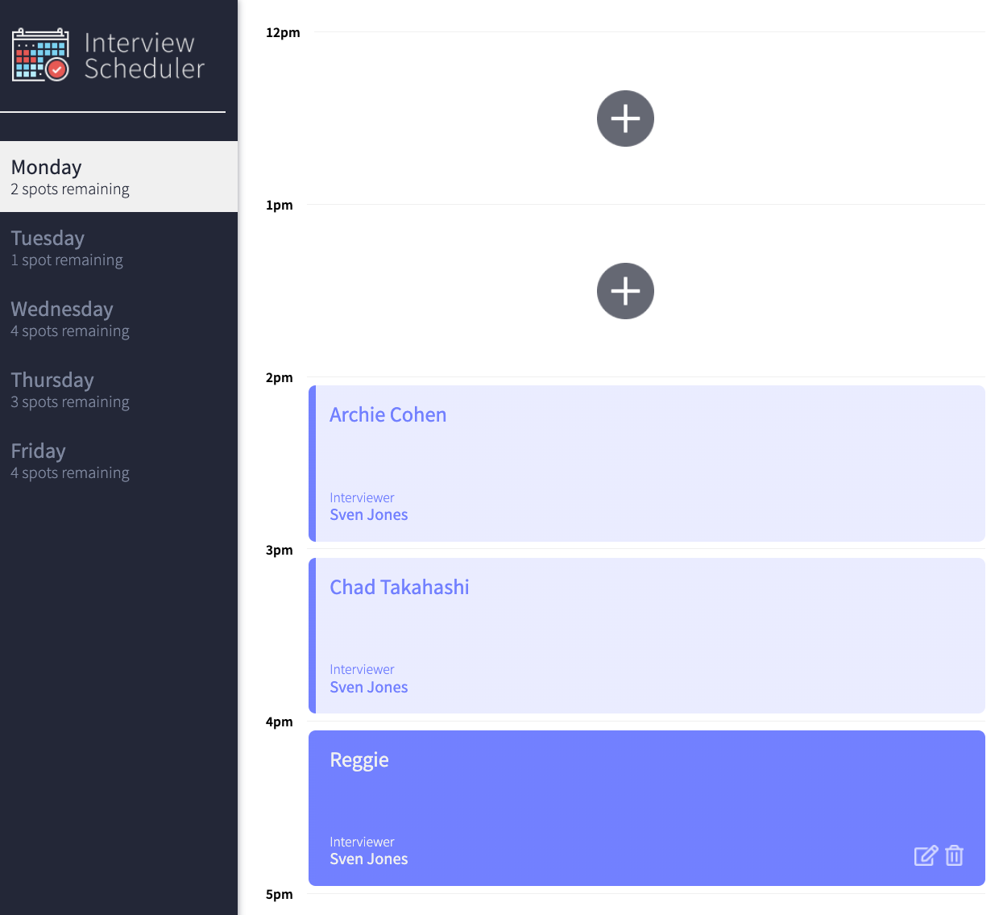
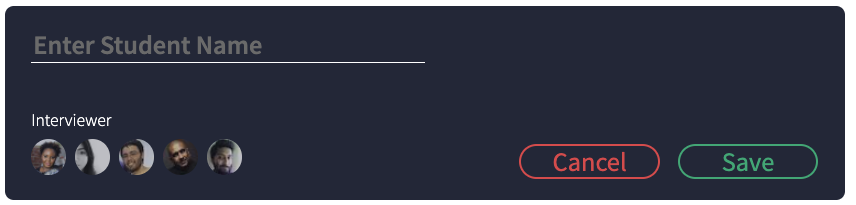

# Interview Scheduler

## Purpose 
A scheduling appointment app made by using React, Javascript. A feature is to edit, delete, and create appointments.  


You can create an appointment also. 



## Setup

Install dependencies with `npm install`.

## Running Webpack Development Server

```sh
npm start
```

## Running Jest Test Framework

```sh
npm test
```

## Running Storybook Visual Testbed

```sh
npm run storybook
```

## Technology 
- Front-End: React, Javascript
- Testing: StoryBook, Jest, Cypress
- Back-End: Javascript, PSQL

## Credit
This project was made based on the [boilerplate project](https://github.com/lighthouse-labs/scheduler/) made by [Francis Bourgouin](https://github.com/FrancisBourgouin) from [Lighthouse Labs](https://www.lighthouselabs.ca/). 
